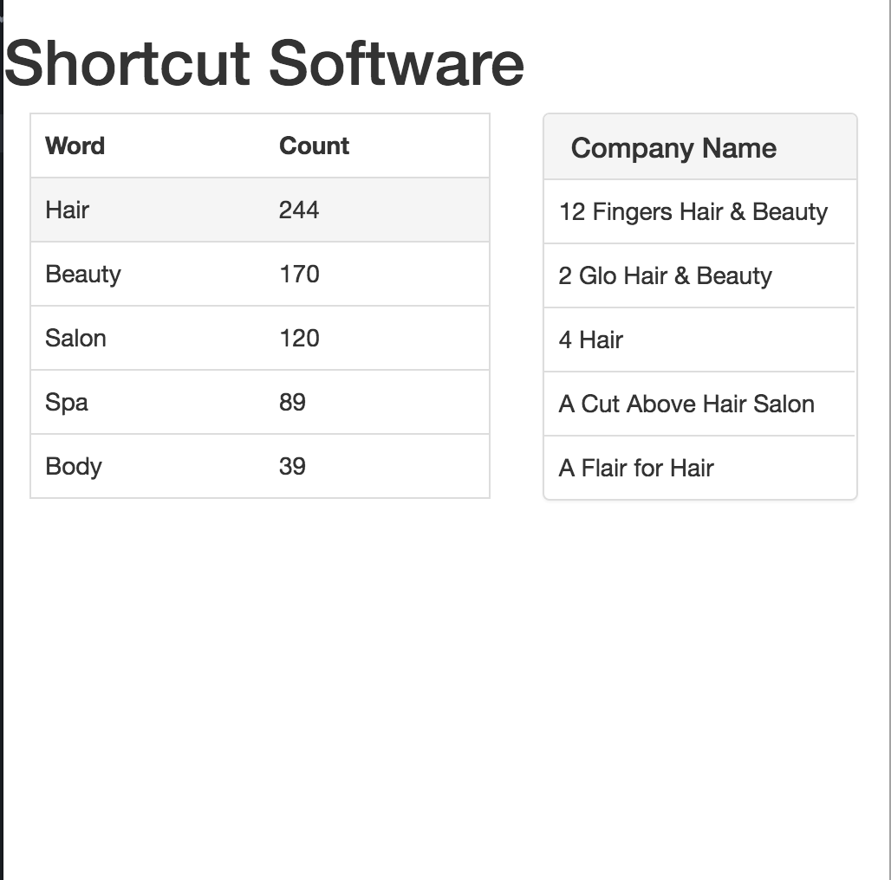

# shortcutTest

##For Test Review
Running Environment -> MAMP or XAMMP, http web hosting.

git clone https://github.com/Fitmavincent/shortcuttest.git

Start up MAMP server, Open localhost:???? in a browser.

#### The goal:

To create a single-page-application using web technologies to perform and display analysis on a pre-defined set of data.

#### Requirement:

* The solution must display use of JavaScript and AJAX technologies to retrieve the source data.
* The solution should conform to modern best practices for web sites including use of CSS.
* The solution must identify the five most common words within the display_name field that:
  1. Have a length greater than two characters
  2. Occur at least once within the set of data
  3. Are not considered common words within the English language such as “and”, “the”, “is” etc.

* The page must display the five identified words, together with the respective count of companies that include that word in their name.
* The words should be displayed in descending order by count with those of equal count ordered alphabetically.
* The page should exhibit dynamic elements.  For example, enabling drilldown on identified words to show a list of up to five companies which include that word in their names.

######[Data source](http://rndtest.shortcuts.com.au/).

##Development Process

####Analyse the test/requirements:

After I read through the whole task, the goal is straight forward: to build a single-page-application, with front-end(basic styling) and back-end(processing the data which is a JSON file containing one object with 999 elements in "display_name" property). It is not hard to come up with a basic MVC framework in my mind.

There are a few of ways I can choose to deploy:
  * ASP.NET. Visual studio supports a "lazy" button that allows me to create the frameworks ready-and-go easily. It is one of the ideal way to deply a Single Page Application(SPA). However, I have relatively less experience with it.

  * PHP framework might be one of the options. It will be a good opportunity for me to finally sit down and study one of the PHP MVC framework. Due to limited time and no experience in PHP MVC framework, I will prefer a light-weighted and easily deploy solution.

**AngularJS. Eventually, I chose build this SPA with AngularJS.**
 * Start with $http.get() for retrieving the data from the [data source](http://rndtest.shortcuts.com.au/) and successfully display on a blank page / console.

 * Manipulate with the data. To achieve the requirement of the task, I need to construct a word frequency dictionary from the predefined data. And then rank the top 5 frequent-occured words from the dictionary.

 * As mentioned in the task, I also need to achieve a requirement of dynamic element on the page, which I need to display 5 companies associated with the words. Therefore, I create a custom object so that I can store data I need. And wrap it into an array.

 * After I successfully return an array with bunch of objects containing words, occurrence of words and associated companies, I started building up controller and directivs in AngularJS to render my data to the front-end page.

One flaw in this development process is that I did not construct a common words dictionary to opt out any common words. Instead, I just simply using if statement, which needs to be done in the next stage.

####Developing & Running Environment
1. Atom Editor
2. MAMP for localhost http server.
3. Browser - Tested successful on Chrome, Firefox and Safari.

####Difficulties
I had some hard time with the process of my solution. None of a project that I built was easy to achieve. Data binding is one of the difficulties that I came across during the development of this SPA. With wrong words and quote, I could not get any data rendering into the front-end and no RED in the console or any other places. Not that I like seeing a red line when I debugging, who doesn't like green. But without any warnings or error message, I need to apply breakpoints and kept reviewing across pages to make sure the data are bind.

Another difficulty is that I did not deploy my solution by using node, npm and bower. Without npm and bower, it is not easy to use some other fancy libraries.

####Yet to Improve
1. Knowledge of web server deployment
2. Cleaner code. Less code to achieve tasks. Optimization.
3. Better organized structure and seperate logic.
4. More familiar with Javascript and boldness to use new libraries and technology.
5. Improve ability and efficiency to grasp core ideas of documentation or manual.
